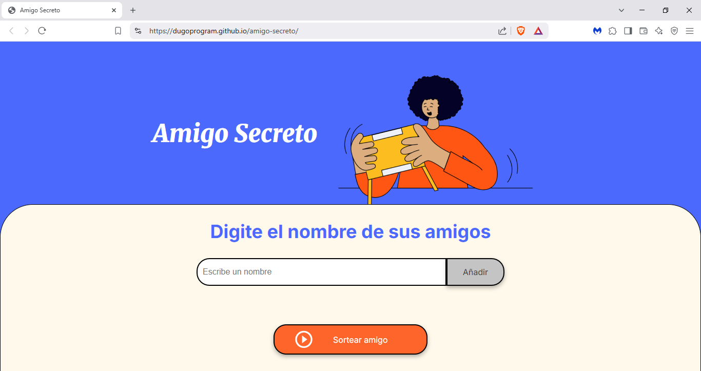
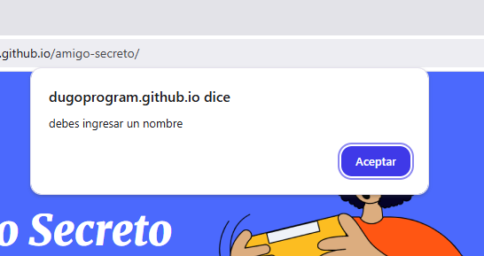
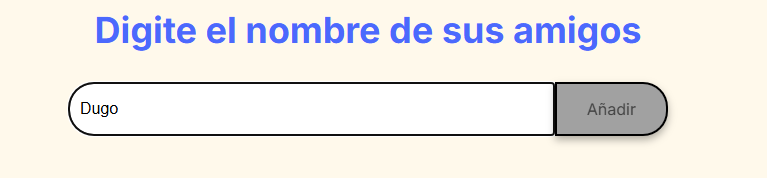
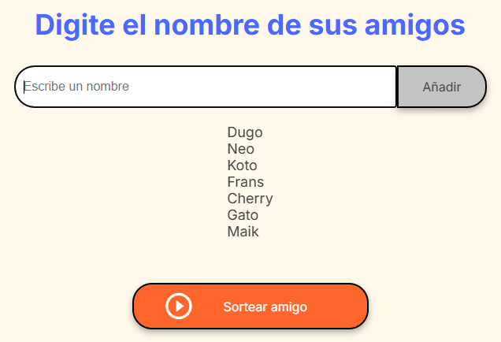
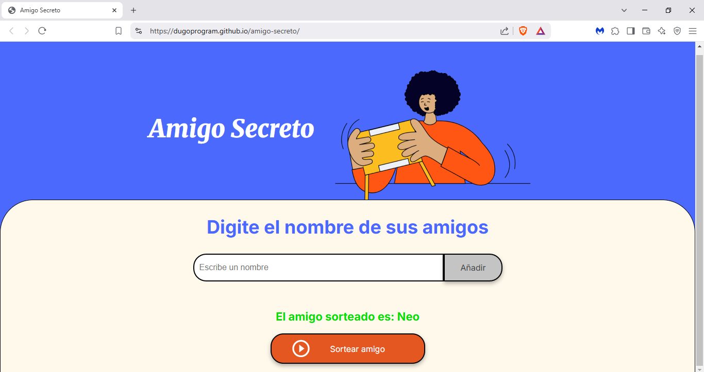
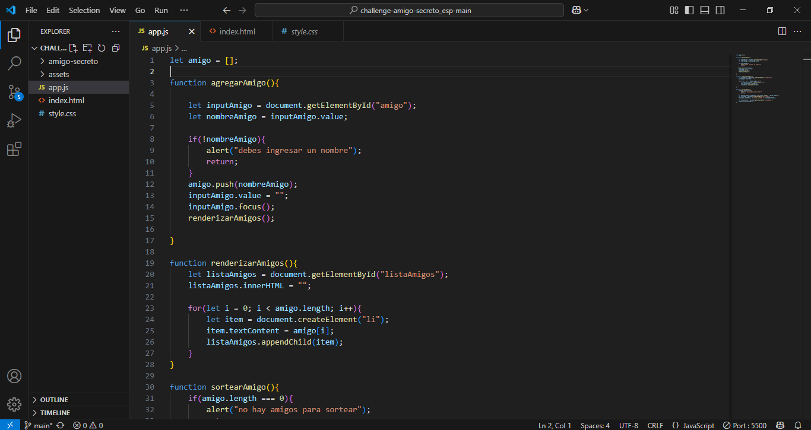
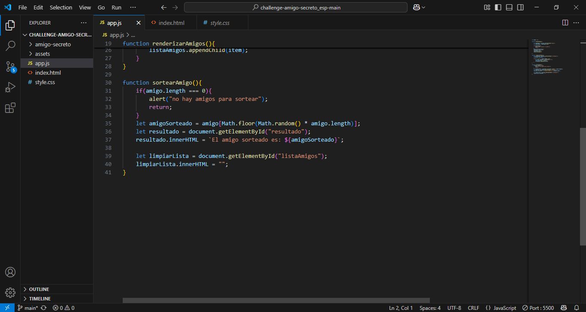
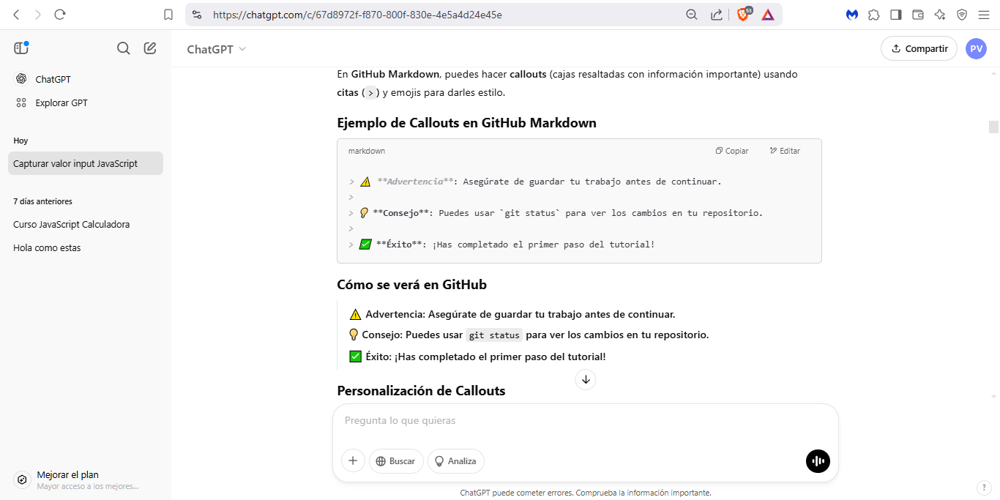
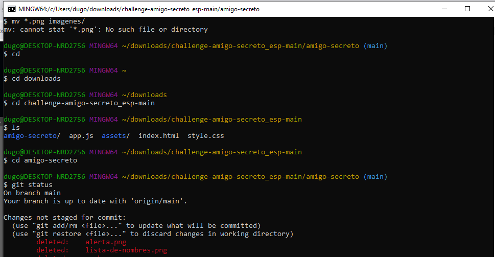

  <h1>Amigo Secreto</h1> 

 **Amigo secreto**: consiste en sortear entre diferentes nombres de amigos/as y el juego seleccionara un/una ganador/a
- Es una pagina sencilla pero __poderosa__ si se utiliza bien, ya que te permite sortear lo que quieras y te puede solucionar dificultades permitiendo ahorrar tiempo si no deseas o no puedes tomar una desicion, a continuacion te muestro algunos ejemplos
- **Puedes sortear**:
 
     -Quien invita las cervezas :beers: y quien las :pizza:

     -Quien saca a pasear a la mascota :elephant::poop:

     -Que video juego jugar :video_game::tv: 

     -Quien se cuida al/la baby :family_man_girl: y darle de comer :baby_bottle::baby:

     -Que outfit escoger :kimono::shirt::jeans::dress:

     -Que comida preparar :fried_shrimp::ramen::hotdog::burrito::meat_on_bone: para sorprender a tu crush :kissing_heart:

     -Y todo lo que quieras, asi puedes ganar :dart:, sorprender :star_struck:, decidir :face_with_spiral_eyes:, evitar peleas :wrestling:, no volver con tu ex :upside_down_face:, etc.

<h2>Indicaciones:</h2>

 **El uso es muy sencillo e intuitivo, de todas formas te dejo el paso a paso:**
1. *Debes entrar en la pagina web [Enlace a la pagina web de amigo secreto](https://dugoprogram.github.io/amigo-secreto/)*
2. *Una vez dentro te debererias ver la pagina principal que luce de esta manera* 

3. :bangbang: *Si presionas el boton "añadir" sin agregar ningun nombre saltara una alerta con el mensaje "debes ingresar un nombre" *
4. *Para agregar nombres correctamente, debes persionar en la barra blanca debajo del texto "digite el nombre de sus amigos", y ahi escribir el nombre deseado y dar click en añadir *
5. *Al añadir los nombres o palabras deseadas a sortear, se iran almacenando en una lista visible* 
6. :sparkles: *Cuando tengas completa tu lista y ya no desees agregar nada mas y solo en ese momento, daras click en "sortear amigo" y gracias a la suerte, ya sea buena o mala si es que el/la debe pagar y tendremos resultado ganaor de :sparkler: un/una elegido/a :sparkler: en el sorteo quien se mostrara en color verde* 

<h3>Programacion</h3>

**Para finalizar te dejo el metodo de trabajo que use para este proyecto**
- Comence trbajando en VS CODE donde fui agregando los codigos en .js  

- Una vez termine por completo el codigo .js del proyecto, lo subi a Github, donde ya tenia mi repositorio creado previamente con un README para dar inicio.

- Use ChatGPT para apoyarme en ciertas dudas que tenia 

- Y lo ultimo tambien use Git para clonar mi repositorio, agregar imagenes, eliminar y mover imagenes dentro de una carpeta creada en el repositorio. 

**Eso seria todo, muchas gracias por usar "Amigo Secreto" te quiero mucho y espero pueda darte diversion y utilidad.**

-Estado de proyecto: finalizado.
